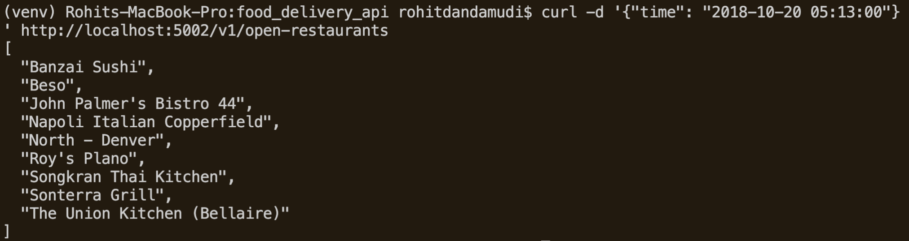
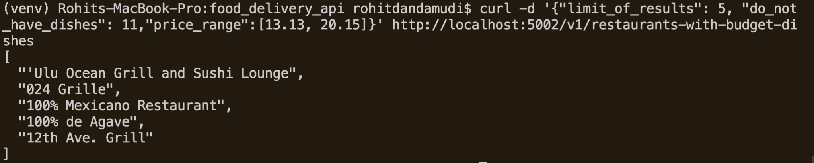
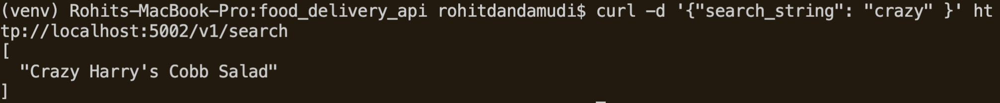
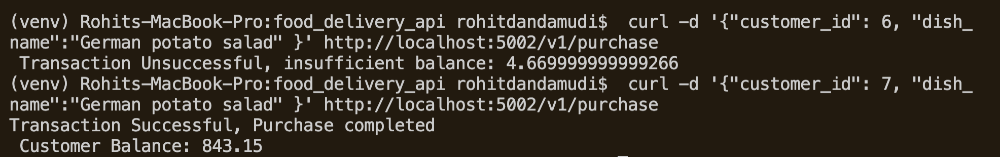

# food_delivery_api
- Food delivery API which can be used by frontend clients to help access information seamlessly
- Tested in Python 3.9.5 in MacOS

## Installation Steps

- Install required dependencies using ```pip3 install -r requirements.txt```
- To run the API, use ```flask run```


## ETL process

- All the steps to extract, transform and load given json datasets into SQL database are done in ```app/etl.py```. 
- Run it using ```python3 etl.py```
    - I have converted the given data into different tables which made sense to me (room for improvement) 
    - This will create an ```etl_application.db``` file in ```app/data``` folder.
    - **NOTE:** It's gonna take some time (00:03:45 in my machine)

- The loaded data in database schema is explained in ```schema.md``` to understand it better.

## Testing application

**NOTE:** No need to do above ETL process steps for testing application, as there is a seperate db file called ```prod_application.db``` in ```app/data``` which is used by the application

- As few steps weren't clear on how data is requested, kindly follow the following structure to get desired output in an other terminal

1. List all restaurants that are open at a certain datetime
    - To get open restaurants at any given datetime 
    ``` 
    curl -d '{"time": "2018-10-20 05:13:00"}' http://localhost:5002/v1/open-restaurants
    ```
    Sample Output: 

2. List top y restaurants that have more or less than x number of dishes within a price range
    - To get list of restaurants with custom settings 
    ```
    curl -d '{"limit_of_results": 5, "do_not_have_dishes": 11,"price_range":[13.13, 20.15]}' http://localhost:5002/v1/restaurants-with-budget-dishes
    ```
    Sample Output: 

3. Search for restaurants or dishes by name, ranked by relevance to search term
    - To fetch matching details 
    ```
    curl -d '{"search_string": "mul" }' http://localhost:5002/v1/search
    ```
    Sample Output: 

4. Process a user purchasing a dish from a restaurant, handling all relevant data changes in an atomic transaction
    - Type this command or something similar 
    ```
    curl -d '{"customer_id": 6, "dish_name":"German potato salad" }' http://localhost:5002/v1/purchase
    ```
    Sample Output: with customer id 6, 7 

## Testing 

- To test the application, move to ```app``` folder and type ```pytest```
- I have tested the preprocessing functions which are crucial to format data.
-  To get code coverage type ```pytest --cov``` Should be 46%
