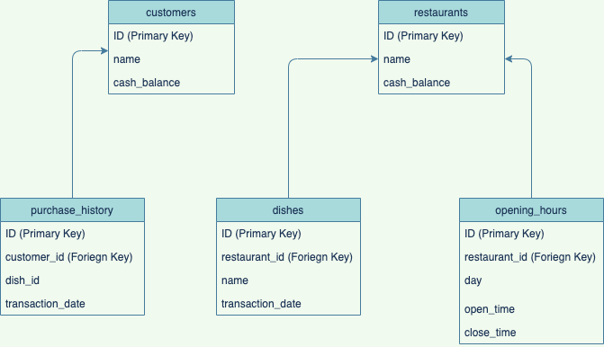

# Database information

## Schema diagram

- The following diagram explins how the database is structured and connected

- All times are in hh:mm:ss and datetimes in yyyy:mm:dd hh:mm:ss
- The opening_hours table stores multiple entries of same restaurant if it extends beyond one day.